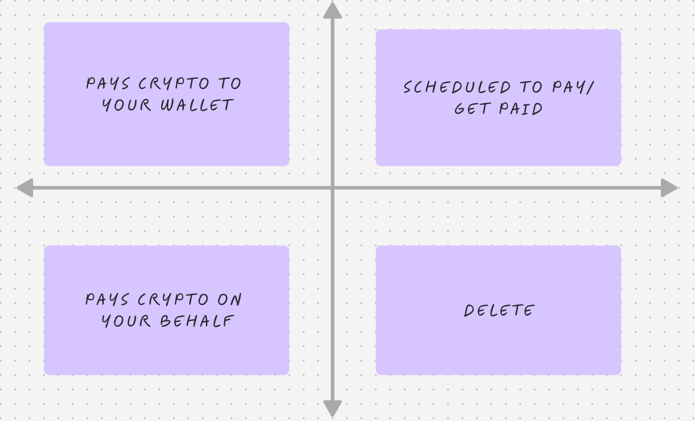

# 🚀 AI-Powered Task & Payment Management Platform

## **Overview**
This platform revolutionizes task management by integrating AI-driven decision-making with onchain payments. Inspired by the Eisenhower Matrix, it categorizes tasks based on urgency and importance while incorporating financial incentives to ensure efficiency. The system enables:

- **Automated Task Prioritization**: AI classifies tasks into four categories: high-value, low-value, redistributable, and disposable.
- **Onchain Payment Redistribution**: Users receive compensation if a task is deemed unworthy of their time, while valuable tasks are delegated or monetized.
- **Smart Scheduling & Logging**: The system intelligently reschedules tasks based on priority and keeps logs for future insights.
- **Decentralized Collaboration**: Tasks can be reassigned to users who are best suited to handle them, ensuring efficiency and fairness.
- **AI-Driven Financial Optimization**: AI agents interact with DeFi protocols to optimize fund allocation for task execution.

## **Target Hackathon Prizes**

### **AI & Agent-Based Automation**
- **Base: Build an AI-powered app on Base** → AI-driven task prioritization and financial redistribution on Base.
- **Gaia & Collab.Land: Mother of All Agents** → Multi-functional AI agent for work management, payments, and scheduling.
- **EigenLayer: Eigen Agents** → AI-powered automation using EigenLayer AVS.
- **Flow: Best AI Agents for Consumers** → End-user-focused AI agent for task and payment automation.

### **Payments & Onchain Financial Flows**
- **Coinbase Developer Platform: Agentic Payments Prize** → Onchain, instant, and permissionless task-based payments.
- **Coinbase Developer Platform: Most Innovative Use of AgentKit** → Use of MPC wallets for automated payouts.
- **Lit Protocol: Best DeFAI Agent** → AI automates DeFi payments, task rewards, and financial scheduling.
- **Warden Protocol: Agents with Best DeFi Skills** → AI-driven smart contract interactions for payments and automation.

### **Smart Contract & AI Interaction**
- **Nethermind: Create Your Agentic Future** → AI interacting with smart contracts for work and compensation.
- **Arbitrum: Most Innovative AI Agent Applications on Arbitrum** → AI-powered task automation deployed on Arbitrum.
- **Covalent: Best Builds or Contributions to the AI Agent SDK** → AI-enhanced API for task classification and payments.
- **Warden Protocol: Intelligent Integrations** → Combining Warden tools with AI for decentralized task management.

### **Privacy & Security for AI Agents**
- **Nillion: Best Use of Nillion SecretVault for AI Agents** → Secure storage of work/payment history for AI-driven automation.

### **Infrastructure & Tooling**
- **AWS: Most Innovative Project Built on Amazon Bedrock** → AI reasoning and decision-making for work prioritization.
- **CoopHive: Best Use of CoopHive** → AI-driven automation for work delegation and payments leveraging CoopHive.

## **Get Involved**
This platform is an innovative leap in task automation and financial redistribution. If you are interested in contributing, feel free to reach out or check out the repository.

## **License**
[MIT License](LICENSE)
